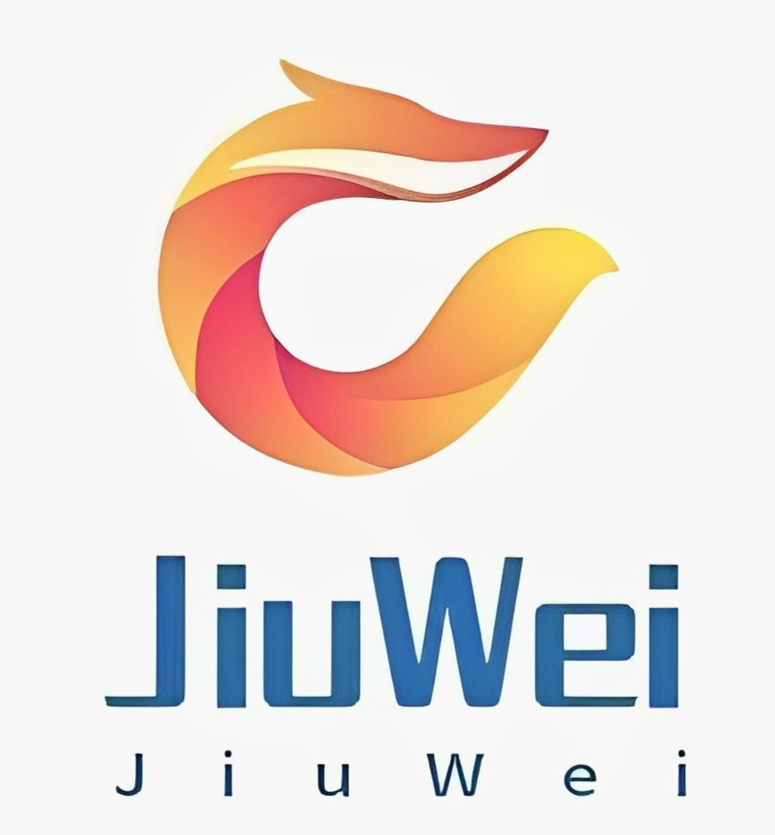

<h1 align="center">
  <br>
  
  <br>
  JiuWei | <a href="https://gitee.com/CNTangyuan/JiuWei-repository">JiuWei-repository</a>
  <br>
</h1>

<h4 align="center">A highly customized and domestic network security package management integration project.</h4>

<p align="center">
    <a href='https://gitee.com/CNTangyuan/JiuWei/stargazers'>
      </img></a>
    <a href='https://gitee.com/CNTangyuan/JiuWei/members'>
      </img></a>
  <a href="https://www.gnu.org/licenses/gpl-3.0.en.html">
      
  <a href="https://www.gnu.org/software/bash/">
      
  </a>
</p>

<p align="center" dir="auto">
  English | <a href="https://gitee.com/CNTangyuan/JiuWei/blob/master/README.md">中文</a>
</p>

## ⚠️ Disclaimer

> This project and the tools included are only for legal and authorized enterprise security purposes. The author is not responsible for any misuse or consequences caused by user abuse. When using this tool, you should ensure that your actions comply with local laws and regulations and have obtained sufficient authorization. Do not scan unauthorized targets.

> If you engage in any illegal activities while using this project and the tools included, you will be solely responsible for the consequences. We will not assume any legal or joint liability. Your use of this tool or any express or implied acceptance of this agreement shall be deemed as you have read and agreed to be bound by this agreement.


## 🏆 Advantages & Features

- Provides installation, update, and uninstallation support for various security tools using "FOX package management".
- Provides convenient access to tools using the PATH environment variable.
- Supports incremental expansion for installing more tools.
- Support for deployment on a wide range of Linux systems.
- More user-friendly design for your experience.


## 🔖 Target Audience

1. Red Team: Targeted attacks and vulnerability scanning.
2. Blue Team: Local defense and vulnerability checking.
3. Tool Developers: Quickly find similar tools, learn from their strengths, and fill in the gaps.
4. Daily Network Security Workers: Learn tool principles and code, facilitate daily vulnerability discovery.


## 🌲 Directory Structure

```
.
├── .bin # Executable & shortcut command files
│   ├── Expand_JiuWei # Expansion installation command
│   ├── Remove_JiuWei # Uninstallation command
│   ├── fox # FOX package management command
│   └── jiuwei # Information & compatibility display command
├── .cache # FOX file download cache storage
│   └── sqlmap.fox # ...
├── .foxindex # Index file storage for FOX package manager
│   └── FOXINDEX # Index file for FOX package manager
├── .have_been_install # Records of installed software packages
├── .packages_info # Records of software package information
├── .packages_name # Records of software package names
├── .expand # Expansion status file
└── config.list # Configuration file
```


## 🌟 Supported Systems

- Kali
- Ubuntu
- Debian
- AlpineLinux
- Darwin
- CentOS
- RedHat
- ArchLinux
- Termux (supports NoRoot)


## 🔧 Quick Deployment

Initialize JiuWei-nano environment status (・∀・)

```
wget "https://gitee.com/CNTangyuan/JiuWei/raw/master/Setup_JiuWei"
chmod +x Setup_JiuWei
./Setup_JiuWei
```

Expand to JiuWei-Expand environment status ((つ≧▽≦)つ)

```
Expand_JiuWei
```

Uninstall JiuWei (ʘᗩʘ’)

```
Remove_JiuWei
```


## 🔆 Configuration File
      ~/JiuWei/config.list


## 📌 Future Plans

- [ ] DOCKER-MODE support
- [ ] Automatic batch update for all tools without specifying
- [ ] Mark key tools for quick selection and use
- [ ] Keyword tagging of tool introductions for easy targeted tool search


## 🚀 Version Iteration Records

Please referto [CHANGELOG](https://gitee.com/CNTangyuan/JiuWei/blob/master/CHANGE.log)


## 👀 References

Many thanks to all the package management tools for their ideas and inspiration in integrating major toolkits.


## 📄 Copyright

This project is licensed under GPL-3.0.

For details, please refer to [LICENSE](https://gitee.com/CNTangyuan/JiuWei/blob/master/LICENSE)


## 💡 Contributions & Contact

You can inform me about new tools and their introductions, write tool FOX files for my project, improve tool introductions, or provide suggestions, etc.
Hope that all experts will contribute enthusiastically ((･ω･)つ⊂(･ω･))

1. [Submit Gitee iSSUES](https://gitee.com/CNTangyuan/JiuWei/issues)
2. [CSDN-TY Tangyuan](https://blog.csdn.net/qq_57851190)
3. [QQ Group - TYXC](http://qm.qq.com/cgi-bin/qm/qr?_wv=1027&k=OVsNn-8iWP5HTTARzTNzfOcgCngXp3gH&authKey=03ZWzlYVvCH6Cpq2Pa7nIEqOFiXw2svp96C896bcZc4Rpg%2FTNk2c2F8asJ4U7tiK&noverify=0&group_code=751386568)